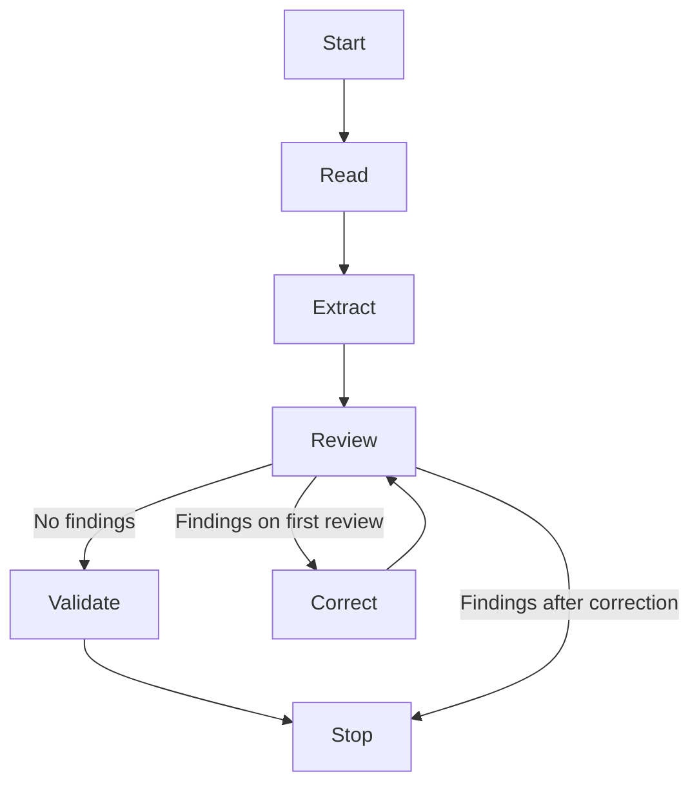

# InvoiceFlow

A Python prototype for Acme Corp's automated invoice processing workflow, based on the [Galatiq invoice processing assessment](https://github.com/galatiq-ai/galatiq-case-invoices).

The planned workflow covers invoice ingestion, structured data extraction, inventory validation, simulated approval, and mock payment processing.

See [CUSTOMIZATIONS.md](CUSTOMIZATIONS.md) for additions beyond the assessment,
their purpose, implementation status, and limits.

## Project status

Inventory setup, document readers, Grok extraction and source review, bounded
correction, and SQLite validation are implemented. `main.py` invokes the LangGraph
workflow in `workflow.py`. Processing output retains review history and UTC events.
Approval, payment, and model tool calling remain pending.

## Python environment

From the repository root, create an isolated environment and install dependencies
(verified with Python 3.12):

```powershell
python -m venv .venv
.venv\Scripts\python -m pip install -r requirements.txt
```

On macOS/Linux, use `.venv/bin/python` in place of `.venv\Scripts\python`.
The `.venv` directory stays local and is excluded from Git. `requirements.txt`
pins direct dependencies; their transitive dependencies are resolved by pip.
Installation requires internet access. Automated tests run without an API key.

## Workflow

`workflow.py` defines separate read, extract, review, correct, and validate nodes.
The CLI supplies the invoice path and a fresh processing record. Nodes return
updates to the shared state; conditional edges select the next operation.



An expected failure at any node records its reason and ends the graph. Correction
runs at most once: the second review either permits validation or stops processing.
Validation issues also end processing with a nonzero CLI exit status. No approval
or payment node exists yet.

Each node copies the processing record before updating it, preserving earlier
snapshots and avoiding shared history between invocations. The API client remains
outside graph state and is closed by the CLI. The graph runs locally without
checkpointing or automatic retries; history remains part of the JSON output.

## Set up the inventory database

Run from the repository root using Python 3:

```sh
python setup_inventory.py
```

This uses Python's built-in `sqlite3` module; no additional packages are needed.
It creates `inventory.db` beside the script with the assessment's seed records:

| Item | Stock |
| --- | ---: |
| WidgetA | 15 |
| WidgetB | 10 |
| GadgetX | 5 |
| FakeItem | 0 |

Running the script again adds any missing seed records without duplicating rows
or overwriting existing stock values. The generated database is excluded from Git.

## Document reading

`read_document(path)` returns source text from TXT, CSV, JSON, XML, and text-based
PDF documents. The bundled Markdown plugin also supports MD. Text files use UTF-8,
with an optional byte-order mark. PDF text is
read across all pages using pypdf. The function does not extract invoice fields,
parse structured formats, or correct source values; all supported formats
pass through Grok for invoice-field extraction and normalization.

Missing files, unsupported formats, decoding failures, corrupt or encrypted PDFs,
and documents without readable text raise `DocumentReadError`. OCR is not
implemented: text inside images is not read, including images within otherwise
readable PDFs. The three supplied PDFs contain extractable text.

The original assessment fixtures are included in `data/invoices`; see
`data/README.md` for their source revision.

## Extract an invoice with Grok

Set `XAI_API_KEY` in the environment or in a local `.env` file beside `main.py`:

```dotenv
XAI_API_KEY=your-api-key
XAI_MODEL=grok-4.6
```

The `.env` file is excluded from Git. Existing environment variables take
precedence over the file. `XAI_MODEL` is optional and defaults to `grok-4.6`.
Run:

```powershell
.venv\Scripts\python setup_inventory.py
.venv\Scripts\python main.py --invoice_path=data/invoices/invoice_1001.txt
```

This command sends the document text to the xAI API and consumes API credits.
It requires internet access and a funded API key. External inventory, approval,
and payment services are not called. The reader supplies text for every supported
format; Grok extracts and normalizes the fields using a JSON schema generated
from `Invoice`. Decimal fields are requested as strings to preserve precision.
Pydantic validates the returned structure locally. Grok then reviews the extraction
against the source before Python checks local inventory. JSON output contains
`invoice`, `validation_issues`, and a `processing` record with events and review history.

The command makes two model calls for a clean extraction, or at most four when
correction is needed. Each call has a 60-second timeout. Extraction has a 2,048-token
output limit; review has a 4,096-token limit. Incomplete output is rejected.
Processing failures write an error to stderr and JSON containing `error` and the
`processing` record to stdout, with exit code 1. Missing credentials and argument
errors occur before processing and are reported to stderr only. Validation issues
also return exit code 1. Exit code 0 means extraction, source review, and the
implemented validation checks passed; it does not mean approval or payment.

A live check of `invoice_1001.txt` returned Widgets Inc., amount `5000.00`,
WidgetA quantity `10`, WidgetB quantity `5`, and due date `2026-02-01`, matching
the source. Currency remained null because `$` alone is ambiguous. This is a
single integration check, not evidence of accuracy across the fixture set.
With validation enabled, this invoice reports unknown currency as a payment blocker.
The review/correction flow has automated mocked coverage; it has not been tested live.

## Source review and correction history

A separate Grok call compares extracted fields with the original reader text.
Findings identify the field or item, extracted value, source excerpt (or null
when unavailable), and explanation. Each application-stamped review includes
its attempt number, UTC start timestamp, outcome, and a snapshot of the invoice.
Source excerpts and explanations are reviewer claims, not independently verified evidence.

When findings exist, extraction receives the original source, previous invoice,
and findings for one correction attempt. The corrected invoice is reviewed again.
Only a clean review permits Python validation. Unresolved discrepancies or model
failures stop processing while preserving earlier findings and invoice snapshots.
If the second review passes, original findings are marked `corrected`. Otherwise,
they retain `unresolved` or `unable_to_determine`; partial corrections are not
individually marked resolved. The second snapshot remains available for comparison.

The reviewer follows the same normalization rules as extraction. For example,
an ambiguous currency correctly represented as null is not an extraction mistake;
Python validation still reports it as a payment blocker. Corrections must follow
the source, even when that causes business validation to fail. Reusing the same
model can repeat an error, so review reduces risk without guaranteeing correctness.

History is included in stdout JSON, not automatically stored in a database or file.
To retain the full result locally:

```powershell
.venv\Scripts\python main.py --invoice_path=data/invoices/invoice_1001.txt > result.json
```

## Invoice validation

The implemented rules require a nonblank vendor, positive amount, due date,
and at least one item with a nonblank name and positive quantity. Unknown currency
is reported as a payment blocker without skipping the remaining checks.
All detected issues are collected. Missing inventory or an unreadable database
is an operational error, not evidence of an invalid invoice.

Item names match SQLite records exactly. Repeated names are combined before
comparing quantities with stock; unknown items and insufficient stock are reported.
Negative lines cannot cancel positive quantities. Validation opens SQLite read-only
and does not reserve or decrement stock. Fractional positive quantities are accepted;
no whole-unit restriction, past-due rejection, or approval amount threshold is imposed.

These are prototype business rules. Arithmetic reconciliation
of invoice totals, currency-code verification, and the approval/payment stages
are not yet implemented. A nonempty currency field alone does not verify a currency.

### Additional file formats

Readers are discovered from `reader_plugins/*.py` at startup. Add a module
exporting `EXTENSIONS` and `read(path) -> str`, install its dependencies, and restart
to enable another format without changing or rebuilding the core application.
See `reader_plugins/README.md` for the contract and bundled Markdown reader.
DOCX and PNG are extension examples, not currently bundled capabilities.

## Data records

`Invoice` contains vendor, amount, currency, items, and due date. `InvoiceItem`
contains an item name and quantity. Missing fields remain `None`; currency is not
inferred. Amounts and quantities use finite `Decimal` values without rounding or
currency conversion. Pass decimal strings or `Decimal` objects to avoid precision
loss before validation. Negative and fractional values remain available for
business validation rather than being silently corrected.

Due dates are calendar dates with no timezone. Extraction must supply an ISO date
or leave it unknown; ambiguous text and timestamps are not converted by the model.
Pydantic reports malformed field values and unexpected fields as schema errors.
Passing schema validation does not establish invoice correctness or approval.

`ProcessingRecord` stores arrival time separately from invoice data. Its
`ProcessingEvent` entries identify a stage, status, timestamp, and optional reason.
Stages are ingestion, validation, approval, and payment; statuses are started,
completed, and failed. The application must supply timezone-aware timestamps;
the models normalize them to UTC while preserving the instant. The CLI generates
arrival and ingestion/validation timestamps. Ingestion includes extraction,
source review, and correction. The record's `reviews` list retains every attempted
review, findings, and invoice snapshots, including when processing fails.

## Tests

Run the automated tests from the repository root:

```sh
.venv\Scripts\python -m unittest discover -s tests -v
```

The tests use Python's built-in `unittest` runner and temporary SQLite databases;
they do not modify your local `inventory.db`. They cover the required seed data,
repeat setup, preservation of changed stock, restoration of missing seed records,
and an invalid database path. A command-line test runs the script in a separate
process and verifies that it creates the database beside the script even when
launched from another working directory.

Model unit tests cover missing data, decimal precision, currency preservation,
calendar dates, malformed records, and UTC timestamp handling.
Document reader tests cover all 20 supplied files, source text preservation,
multiple PDF pages, and unreadable or unsupported inputs.
Plugin tests cover discovery, restart behavior, extension conflicts, invalid
definitions, dependency failures, reader errors, and execution in a fresh process.
Extraction tests mock the xAI boundary and cover precise decimals, missing fields,
malformed and incomplete output, and provider failures. CLI integration tests use
the real document reader and a temporary SQLite database with mocked Grok responses.
Validation tests cover required fields, repeated items, stock boundaries, exact
quantity aggregation, unknown currency, unchanged stock, and database failures.
The automated suite makes
no paid model calls and does not load a real API key.
Graph tests cover clean reviews, bounded correction, original snapshots,
retained findings, uncertain source data, malformed/incomplete reviews, and API
failures during correction or re-review. CLI integration tests verify that
unresolved review skips inventory validation and emits the retained history.
Route tests cover read, extraction, review, correction, and inventory failures,
plus repeated graph invocations without shared history.
The inventory tests are database integration tests and a setup CLI test. End-to-end invoice
processing tests will be added when that workflow is implemented.

## Change control

Develop changes on feature branches and review them through pull requests before merging into `main`.
